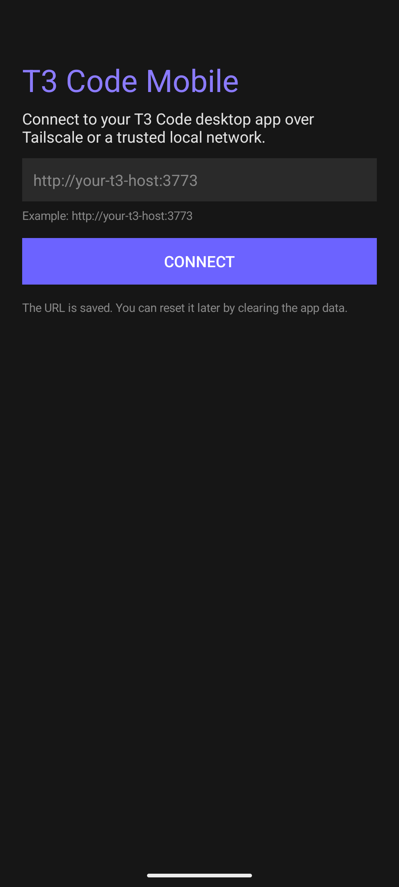
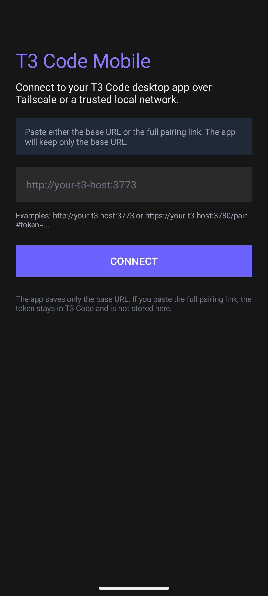
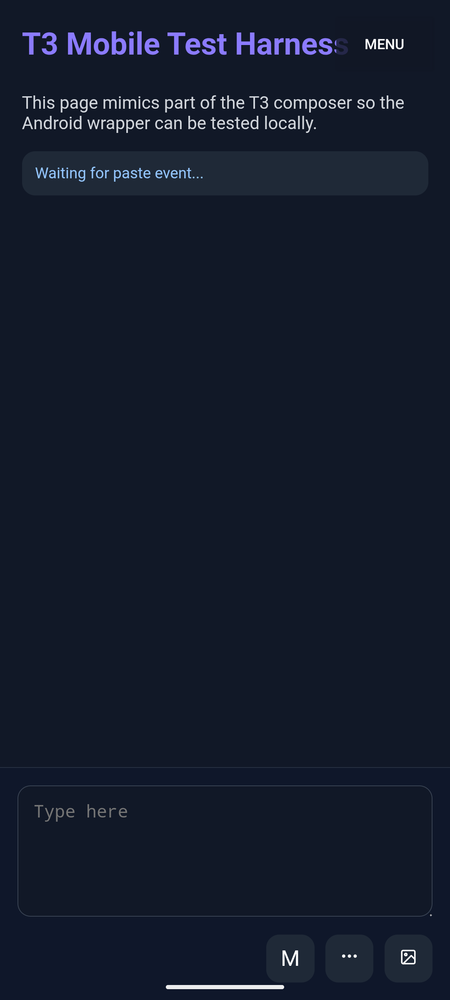

# T3 Code Mobile

[](https://github.com/JSvandijk/t3code-mobile/actions/workflows/ci.yml)
[](LICENSE)
[](#installation)
[](INSTALLATION-GUIDE.md)

An unofficial Android companion app and optional HTTPS/PWA proxy for [T3 Code](https://github.com/pingdotgg/t3code).

`t3code-mobile` is built for one specific job: make your own T3 Code session usable from your phone with the least possible setup friction. It wraps a local T3 Code desktop instance in a fullscreen Android WebView, remembers the server URL, and keeps an inline photo upload shortcut available inside the chat composer.

The pitch is simple: reliable, browserless, lightweight T3 access on Android. This repo does not try to become a heavy mobile control plane. It tries to be the cleanest and most dependable way to use your existing T3 Code session from a phone.

## At A Glance

- Browserless Android experience with no visible URL bar or browser chrome
- Lightweight companion scope instead of a broader remote-agent dashboard
- Reliability-first behavior: diagnostics, scoped navigation, smoke tests, and visible failure handling
- Fast self-hosted phone access over Tailscale or a trusted local network





## Why This Project Exists

The upstream T3 Code project is the real product. This repository is intentionally narrower:

- It is mobile-first and self-hosted.
- It assumes you already run T3 Code on your main machine.
- It optimizes for quick phone access over Tailscale or a trusted LAN.
- It stays lightweight instead of becoming a broader remote-agent platform.

If that is the exact problem you have, this repo is deliberately small enough to understand, modify, and improve. Less product surface is a feature here: fewer moving parts, less UI clutter, and fewer opportunities for mobile-specific breakage.

## Why This Is More Than A Simple Wrapper

The interesting work in this repo is not "open a website in a WebView." The value comes from handling the sharp edges around that idea:

- The app accepts a full T3 pairing link, extracts only the base URL, and avoids storing the token in app state.
- The WebView stays scoped to the configured T3 host instead of turning into a general browser shell.
- The inline upload control is reinjected after SPA navigation so the feature survives real T3 UI transitions.
- The app produces copyable connection diagnostics instead of leaving users with a blank "it failed" state.
- The optional proxy adds installable PWA behavior and a machine-readable health endpoint for support and smoke testing.

If another T3 user or contributor opens this repo, they should be able to see both the product value and the engineering discipline quickly.

## What You Get

- Native Android WebView wrapper with no browser chrome
- One-time base URL setup with reconnect support
- Full pairing links can be pasted; the app extracts and saves only the base URL
- In-app menu for reload, connection info, and changing the saved server
- Copyable in-app diagnostics report with HTTP, SSL, and network summaries
- Persistent inline image upload button next to the composer controls
- MutationObserver-based reinjection so the upload button survives SPA navigation
- Optional HTTPS reverse proxy that adds a manifest, service worker, installable PWA behavior, and a health endpoint
- Portable local WebView harness for HTTP, invalid-HTTPS, and redirect testing
- Windows-friendly APK build flow without needing a full Gradle project workflow
- Proxy smoke test that verifies HTML injection, static assets, and the proxy health endpoint
- Tag-driven GitHub release flow with versioned APKs and checksum output

## Engineering Highlights

- Browserless mobile access: the Android wrapper removes browser chrome and keeps the session focused on T3 Code.
- Safer pairing flow: full pairing links are accepted for convenience, but only the base server URL is stored.
- Support-first diagnostics: HTTP, SSL, and network details can be copied from inside the app for faster triage.
- Resilient upload UX: the photo button is restored after upstream SPA transitions rather than relying on a one-shot DOM injection.
- Testable proxy mode: the optional HTTPS proxy exposes `GET /__t3mobile/health`, reports upstream latency, and has a smoke test for HTML injection and assets.
- Contributor-ready harness: `npm run harness:http`, `harness:https-bad-cert`, and `harness:redirect` make Android WebView behavior reproducible.
- CI-safe proxy smoke test: the proxy test can generate temporary self-signed certificates when local TLS files are absent.
- Upstream-friendly scope: the repo stays narrow enough to complement T3 Code instead of drifting into a general remote-agent product.

## Quick Start

1. Install Tailscale on your computer and Android phone.
2. Open T3 Code on your computer.
3. In T3 Code, go to `Settings` -> `Connections` -> `Create Link`.
4. Install the APK on Android.
5. Enter your base URL, for example `http://your-t3-host:3773`.
6. Complete the standard pairing flow using the token from the desktop app.

Detailed instructions live in [INSTALLATION-GUIDE.md](INSTALLATION-GUIDE.md).

## Project Layout

- `apk/`: Android app source
- `server.js`: optional HTTPS reverse proxy for PWA mode
- `webview-harness.js`: local HTTP and invalid-HTTPS harness for Android runtime checks
- `manifest.json` and `sw.js`: installable PWA assets
- `build-apk.bat`: Windows APK build script
- `generate-icons.js`: icon generation helper
- `tmp-webview-harness/`: static harness page used by the local WebView server
- `docs/`: comparison notes, publishing checklist, screenshots, and showcase docs

## Build And Run

### Build The APK

Requirements:

- Windows
- Android SDK with `build-tools 36.1.0`
- Android platform `android-35`
- JDK 11+
- PowerShell 5+

```bat
build-apk.bat
```

This builds `apk/build/output/T3Code-v<version>.apk`, copies the same file to the repo root as both `T3Code.apk` and `T3Code-v<version>.apk`, and injects Android `versionCode` and `versionName` from `package.json`.

Without release-signing environment variables, the script uses a local development keystore and prints a warning. That output is fine for local testing but not for public GitHub releases or cross-machine update compatibility.

For stable public updates, configure these GitHub Actions secrets and publish with a tag that matches `package.json`, for example `v1.1.0`:

- `APK_KEYSTORE_BASE64`
- `APK_KEYSTORE_PASSWORD`
- `APK_KEY_ALIAS`
- `APK_KEY_PASSWORD`

### Run The Optional PWA Proxy

Use this mode if you want an installable browser version instead of the native APK.

```bash
npm install
npm start
```

Set the environment variables from [.env.example](.env.example) if you need custom paths or ports. The proxy expects valid TLS files via `SSL_KEY_PATH` and `SSL_CERT_PATH`.

The proxy also exposes `GET /__t3mobile/health`, which returns JSON about the proxy process, the configured upstream timeout, upstream reachability, and probe latency.

## How It Works

- The Android app opens your T3 Code instance in a fullscreen WebView.
- The app keeps navigation scoped to the configured T3 server; other links are handed off to the device browser.
- The app can generate a copyable diagnostics report with the current URL, active network, HTTP probe results, and last-known SSL or HTTP failure details.
- After each page load, the app injects a custom image button into the composer footer.
- A hidden file input is recreated when needed during SPA navigation.
- Selected images are passed into T3 Code through a `ClipboardEvent` paste flow.
- The optional proxy injects PWA metadata and service worker registration into the upstream HTML, keeps upstream connections alive for lighter reconnects, and exposes a lightweight health endpoint for smoke tests and troubleshooting.

## Proof And Assets

- Public showcase notes: [docs/SHOWCASE.md](docs/SHOWCASE.md)
- Screenshot and caption guide: [docs/SCREENSHOTS.md](docs/SCREENSHOTS.md)
- Local runtime harness: [docs/WEBVIEW-HARNESS.md](docs/WEBVIEW-HARNESS.md)
- Project comparison: [docs/COMPARISON.md](docs/COMPARISON.md)
- Upstream-fit notes: [docs/UPSTREAM-FIT.md](docs/UPSTREAM-FIT.md)

The goal is to make the public repo easy to evaluate: what problem it solves, what work was technically hard, what evidence exists, and where outside contributors can add value.

## Security Notes

- The app no longer proceeds past invalid TLS certificates.
- HTTPS is preferred when you can issue a trusted certificate.
- Cleartext HTTP remains supported for Tailscale or another trusted private network because that is a core self-hosted use case, but the app now warns before every HTTP session.
- The app intentionally stays scoped to one configured server host inside the WebView; other destinations open outside the app.

See [docs/SECURITY-AUDIT.md](docs/SECURITY-AUDIT.md) for the current audit notes, fixes, and remaining tradeoffs.

## Contributing

If you want to help this become a stronger community project, start here:

- Read [CONTRIBUTING.md](CONTRIBUTING.md)
- Check [ROADMAP.md](ROADMAP.md)
- Look for issues labeled `good first issue` or `help wanted`
- Use the issue forms for bug reports and feature proposals

High-value contribution areas right now:

- automated Android runtime smoke tests
- safer SSL and network handling
- more resilient composer button injection
- richer diagnostics for device-specific WebView failures
- better onboarding docs and screenshots

## Community And Support

- Support guide: [SUPPORT.md](SUPPORT.md)
- Security policy: [SECURITY.md](SECURITY.md)
- Code of conduct: [CODE_OF_CONDUCT.md](CODE_OF_CONDUCT.md)
- Showcase notes: [docs/SHOWCASE.md](docs/SHOWCASE.md)
- Screenshot guide: [docs/SCREENSHOTS.md](docs/SCREENSHOTS.md)
- WebView harness: [docs/WEBVIEW-HARNESS.md](docs/WEBVIEW-HARNESS.md)
- Project comparison: [docs/COMPARISON.md](docs/COMPARISON.md)
- Upstream-fit notes: [docs/UPSTREAM-FIT.md](docs/UPSTREAM-FIT.md)
- Launch checklist: [docs/PUBLISHING-CHECKLIST.md](docs/PUBLISHING-CHECKLIST.md)

## Status

This repo is public and usable today, but still early. The current priority is reliability, better onboarding, and making it easy for outside contributors to help without having to reverse-engineer the codebase.

One honest current limitation: Android runtime verification is still more manual than it should be. The repo now has a proxy smoke test and stronger in-app diagnostics, but emulator or device-level WebView regression coverage still needs another pass.

## Positioning

This repo is not trying to compete with broader remote-agent projects. It is a narrower companion app for T3 Code users who want the smallest practical path from desktop to phone.

See [docs/COMPARISON.md](docs/COMPARISON.md) for a short comparison against upstream T3 Code and related mobile-first projects.

## Disclaimer

This is an unofficial companion project. It is not affiliated with, endorsed by, or maintained by Ping.gg or Theo Browne.

## License

MIT
